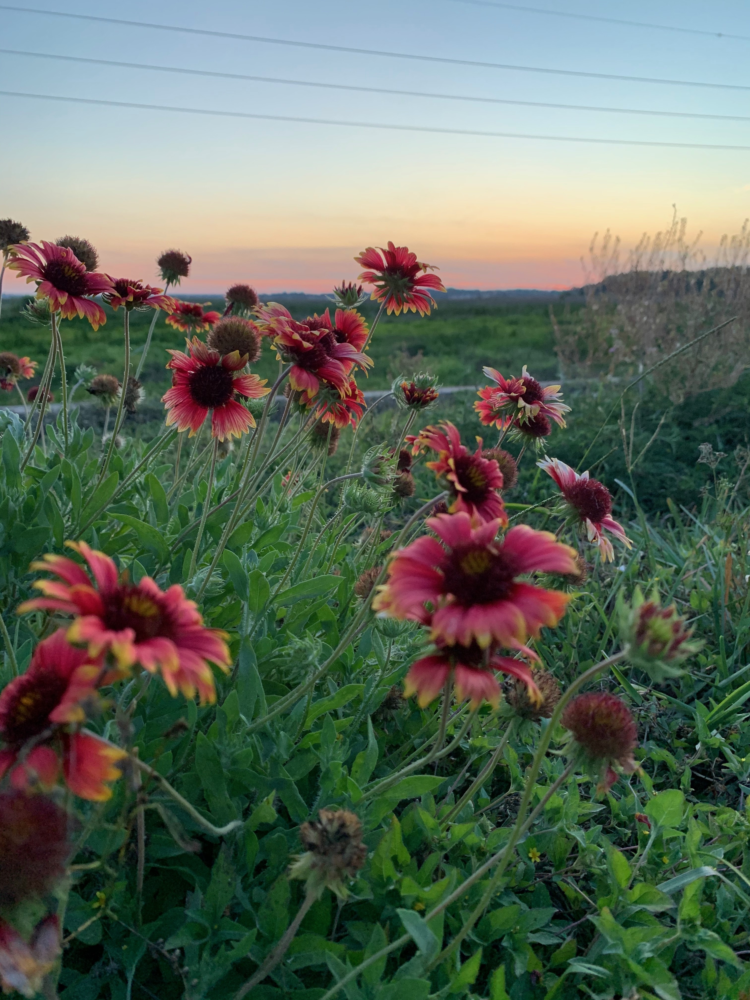

# Paynes Paraie
## A Gainesville Classic

The image below was taken at Paynes Prarie. Paynes is a Florida State Park just south of Gainesville just north of Micanopy. This prarie acts as a basin which during huricane Irma collected several feet of water and has been flooded for the following 5 years, with standing water still remaining today. This basin drains into the Alchua Sink. 

This location also provides lots of entertainment for the people of Gainesville, simple as it is. It is a common passtime of the Gainesville residents to park your cars along the highway, watch the sunset, and stargaze. It is common to see wild horses and bison here.

